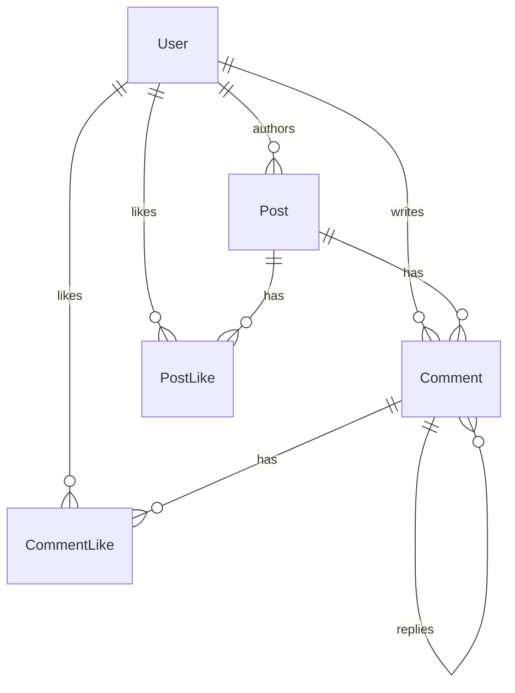

# Project Documentation & Architecture Decisions

This document details the design, architecture, key technical decisions, and testing setup for the Appifylab Social Feed full-stack application.

---

## 1. Project Overview & Architecture
The project is built as a TypeScript monorepo using **NPM Workspaces**:
*   `apps/web`: React 19 single-page application built with Vite and TailwindCSS, using the provided design files.
*   `apps/api`: Express 5 REST API handling backend logic, validation, storage integrations, and notifications.
*   `packages/shared`: Shared validation schemas (Zod) and type definitions shared across the frontend and backend.

---

## 2. Technology Stack & Technical Choices

### Frontend
*   **React 19 & Vite**: Provides lightning-fast HMR and supports modern rendering features.
*   **TanStack Query (React Query v5)**: Manages server-state synchronization, query caching, invalidations, and provides clean optimistic UI updates for reactions (likes).
*   **Zustand**: Lightweight UI state management used for theme switches (light/dark modes), sidebar toggle states, and global modals.

### Backend & Database
*   **Express 5**: The latest Express framework, providing native promise-based error handling.
*   **Prisma ORM**: Type-safe database client. Pushed database schemas and relationships securely to PostgreSQL.
*   **PostgreSQL (Supabase)**: Relational database hosted on Supabase.
*   **Supabase Storage**: Object storage used to store post images securely with time-limited signed URLs generated on-the-fly.

---

## 3. Database Schema Design & Scalability
The schema in `apps/api/prisma/schema.prisma` is designed for fast reads and writes under high loads (millions of posts):



### Performance & Scalability Design Decisions:
1.  **Read Optimization (Indexes)**:
    *   `Post` table has compound indexes on `[visibility, createdAt, id]` and `[authorId, createdAt]`. This allows fast feed generation for public/private posts sorted by newest first without full table scans.
    *   `Comment` table indexed on `[postId, parentId, createdAt]` to quickly pull flat comments and nested replies sorted chronologically.
2.  **Denormalization**:
    *   `Post` stores `likeCount` and `commentCount` explicitly. This avoids expensive aggregate count queries when loading the feed, making reads highly performant. These counts are incremented/decremented atomically in database transactions during likes and comments.

---

## 4. Key Security Practices
*   **Secure Authentication**: JWT-based access and refresh tokens. The refresh token is stored in a secure, `HttpOnly`, `SameSite=Lax` cookie to protect against Cross-Site Scripting (XSS) and token theft.
*   **CSRF Protection**: Stateful POST/PUT/DELETE requests require a custom `x-csrf-token` header validated on the backend.
*   **Rate Limiting**: Rate limiters applied to auth endpoints to prevent brute-force attacks.
*   **Signed Storage URLs**: Direct download links to post images are never exposed. Instead, the backend generates 10-minute time-limited signed URLs (`createSignedUrl`) on demand.

---

## 5. Critical Problem Solving & Engineering Decisions

### Database Connection Pooler (IPv6 vs IPv4)
*   **Problem**: Supabase direct database connection hosts (`db.<ref>.supabase.co`) use IPv6-only DNS records. Local testing environments without native IPv6 connectivity failed to connect.
*   **Solution**: Switched connection strings to use the regional connection pooler host (`aws-1-ap-south-1.pooler.supabase.com`) on port `5432` (Session mode), which resolves successfully to IPv4 and supports migrations.

### Express 5 req.query Write Restrictions
*   **Problem**: Express 5 enforces read-only query properties on the HTTP Request object. Re-assigning parsed query parameters directly (`req.query = ...`) threw a `TypeError`.
*   **Solution**: Used `Object.defineProperty(req, "query", { value: parsed.data, writable: true })` to safely inject parsed/sanitized query inputs from our Zod validation middleware.

### React Query Envelope Bug
*   **Problem**: API routes wrap output lists inside a `{ data: [...] }` envelope, but frontend React hooks like `usePostLikes` and `useCommentLikes` mapped responses directly as arrays, resulting in a `TypeError: likes.map is not a function` error inside the UI modal.
*   **Solution**: Updated frontend query functions to correctly unpack the `{ data }` envelopes.

---

## 6. Playwright End-to-End Testing

### Setup & Run:
Tests are configured in the root workspace directory. Playwright automatically boots frontend and backend dev servers via `npm run dev` before running the test cases.

To execute the tests:
```bash
npm run test:e2e
```

### Covered Test Scenarios:
1.  **Redirection**: Direct navigation to `/feed` redirects to `/login`.
2.  **Auth Flow**: Registration of new users, redirecting to the Feed page, and profile-based logouts.
3.  **Public vs Private Post Visibility**:
    *   Alice logs in and creates a Public and a Private post.
    *   Bob logs in and verifies Alice's Public post is visible, while Alice's Private post is hidden from his feed.
4.  **Social Interactions**: Bob liking Alice's public post, posting a comment, liking his own comment, and Alice replying to Bob's comment.
5.  **Reactions Modals**: Clicking the like counter to open the "Liked By" modal and verifying Bob is listed.
